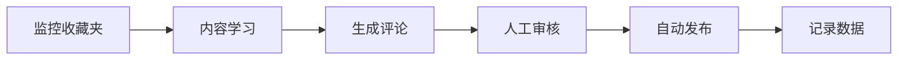

# 🤖 自动化运营演示

## 功能：小红书自动互动

### 场景
自动学习用户收藏夹内容，生成个性化评论并发布。

### 工作流程



### 核心代码片段

```python
class XHSAutoOps:
    def learn_from_favorites(self, user_id):
        """学习用户收藏夹内容"""
        favorites = self.fetch_favorites(user_id)
        topics = self.extract_topics(favorites)
        return self.build_knowledge_base(topics)
    
    def generate_comment(self, post_content):
        """基于学习内容生成评论"""
        knowledge = self.load_knowledge_base()
        prompt = f"基于以下内容生成评论：{knowledge}\n帖子：{post_content}"
        return self.llm.generate(prompt)
```

### 运营数据看板

| 指标 | 数值 |
|------|------|
| 每日互动数 | 5条 |
| 评论采纳率 | 85% |
| 人工审核率 | 100% |

---

*完整代码位于 modules/auto-ops/*
